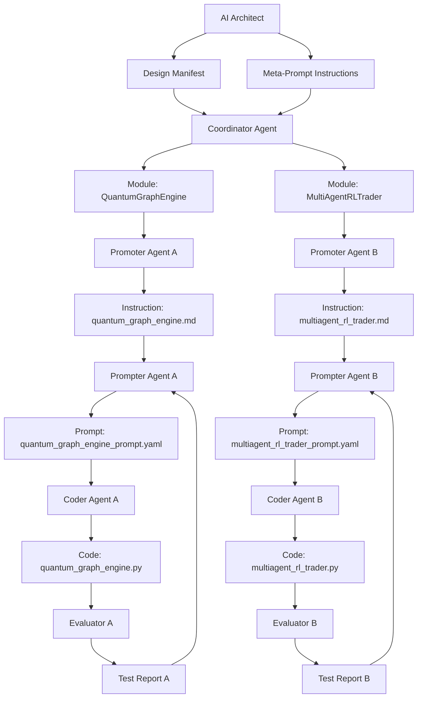

# 💹 Quantum Virtual Finance (QVF) Project

### *Using AI to Build AI*

A Multi-Agent Coding Framework for Building the Quantum Financial Simulation Platform

## 🌐 Project Overview

QVF simulates market intelligence using quantum graph models and classical + quantum indicators, built entirely by a layered AI workforce that designs, codes, tests, and refines every module recursively.

## 🧱 Multi-Agent Development Stack

| Layer | Role                         | Responsibility                               |
|-------|------------------------------|----------------------------------------------|
| 0     | AI Architect                 | Defines vision, architecture, meta-prompts   |
| 1     | Coordinator Agent            | System decomposition and module assignment   |
| 2     | Promoter Agents              | Module-level functional specifications       |
| 3     | Prompter Agents              | Structured prompt generation                 |
| 4     | Coder Agents                 | Python module generation                     |
| 5     | Evaluation & Feedback Agents | Testing, refinement, and scoring             |

## 🔁 Workflow Diagram



## 📁 Folder Structure

```
qvf_project/
├── architect/
│   ├── qvf_vision_doc.md
│   ├── design_manifest.yaml
│   └── meta_prompt_instructions.json
├── coordinator/
│   ├── component_plan.yaml
│   ├── agent_assignment.json
│   └── flowchart_workflow.svg
├── promoters/
│   └── instructions/
│       ├── quantum_graph_engine.md
│       └── indicator_fusion_module.md
├── prompters/
│   └── prompts/
│       ├── multiagent_rl_trader_prompt.yaml
│       └── market_data_parser_prompt.yaml
├── coders/
│   └── src/qvf/
│       ├── quantum_graph_engine.py
│       ├── multiagent_rl_trader.py
│       └── code_trace_log.json
├── evaluators/
│   └── tests/
│       └── test_indicator_fusion_module.py
├── feedback/
│   ├── refactor_rl_trader.md
│   └── evaluation_report.md
├── shared_memory/
│   └── chroma_vector_store/
└── README.md
```

## ⚙️ Toolchain

| Purpose                   | Tools                     |
|---------------------------|---------------------------|
| Prompting & Orchestration | LangChain, LangGraph      |
| Code Generation           | GPT-4, Codex              |
| Financial Modeling        | Pandas, NumPy, TA-Lib     |
| Quantum Computation       | Qiskit, PennyLane         |
| Multi-Agent RL            | RLlib, PettingZoo         |
| Memory & Feedback         | ChromaDB, LangSmith       |

## 🚀 Why QVF Matters

QVF is not a static platform. It's a recursive, self-evolving intelligence stack that interprets, learns, and trades — with **every line of code built by agents**, not humans.

This is what it means to build AI with AI — on the edge of quantum markets and reinforcement learning.